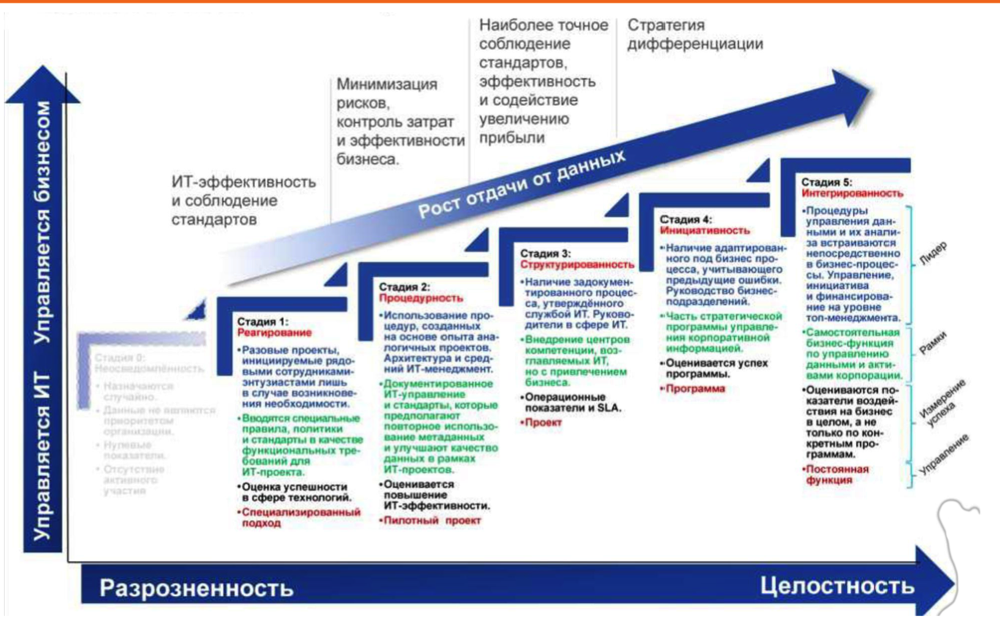

# 22. Стратегия управления данными. Жизненный цикл данных. Модель данных

### Жизненный цикл данных:

Захват данных -> Поддержка данных -> Синтез данных -> Использование -> Публикация -> Архивация данных -> Очистка данных

---

### Модель данных - способ структурирования данных

* Конценптуальная
* Логическая
* Физическая
  Все они могут быть корпоративными !!!

---

### Концептуальная модель данных

Подразумевает под собой использование некой концепции на разбиение по блокам, схожа с "блок-схемой"

> Таблица - прямоугольник
>
> Составляющее - кружок или овал
>
> Действие - ромбик, поделенный на две чачти, ибо операции двухсторонние

---

### Логическая модель данных

Подразумевает под собой  указание связи между таблицами и над каждой стрелкой надпись, как работают между собой (Включает, оформляет, составляет и т.п.)

---

### Физическая модель данных

Представляет собой такую же связь, только без указания направления, просто, как диаграмма в БД SQL
